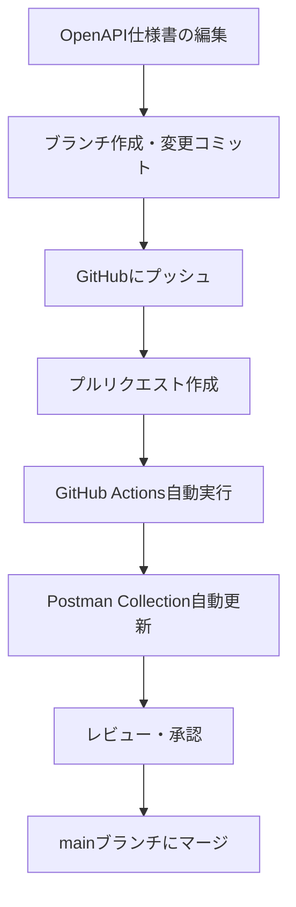

# 運用ガイドライン - Postman Collection自動更新

## 📋 概要

このドキュメントは、OpenAPI仕様書の更新時にPostman Collectionが自動更新される運用フローについて説明します。

## 🔄 基本的な運用フロー

### 1. 開発者の作業フロー



### 2. 具体的な手順

#### ステップ1: OpenAPI仕様書の編集
```bash
# 新しいブランチを作成
git checkout -b feature/update-api-spec

# OpenAPI仕様書を編集
vim specs/auth-api.yml

# 変更をコミット
git add specs/auth-api.yml
git commit -m "feat: add new API endpoint"
git push origin feature/update-api-spec
```

#### ステップ2: プルリクエスト作成
- GitHubでプルリクエストを作成
- タイトルと説明を適切に記述
- レビュアーを指定

#### ステップ3: 自動化の確認
- GitHub Actionsが自動実行されることを確認
- `Actions`タブで実行状況を監視
- エラーがある場合は修正

#### ステップ4: レビューとマージ
- 生成されたPostman Collectionをレビュー
- 問題がなければプルリクエストをマージ

## ⚙️ GitHub Actions動作条件

### 実行トリガー
- プルリクエストの作成時 (`opened`)
- プルリクエストの更新時 (`synchronize`)
- 対象ブランチ: `main`

### 実行条件
- OpenAPI仕様書 (`specs/auth-api.yml`) に変更がある場合のみ実行
- フォークリポジトリからのプルリクエストは除外

## 📁 関連ファイル

| ファイル | 説明 | 編集権限 |
|---------|------|----------|
| `specs/auth-api.yml` | OpenAPI仕様書 | 開発者 |
| `postman/collections/saasus-auth-api.json` | 生成されるPostman Collection | 自動生成 |
| `.github/workflows/update-postman-collection.yml` | GitHub Actionsワークフロー | 管理者のみ |
| `scripts/convert-openapi.js` | 変換スクリプト | 管理者のみ |

## 🚨 トラブルシューティング

### よくある問題と対処法

#### 1. GitHub Actionsが実行されない
**原因**: OpenAPI仕様書に変更がない
**対処**: `specs/auth-api.yml`に実際の変更があることを確認

#### 2. Collection生成でエラーが発生
**原因**: OpenAPI仕様書の形式エラー
**対処**: 
- OpenAPI仕様書の文法を確認
- オンラインバリデーターで検証
- ローカルでテスト実行

#### 3. Collection IDが変更される
**原因**: ID保持ロジックの問題
**対処**: 既存のCollectionを確認し、必要に応じて手動で修正

### エラー時の確認手順

1. **GitHub Actionsログの確認**
   ```
   GitHub → Actions → 失敗したワークフロー → ログ詳細
   ```

2. **ローカルでのテスト実行**
   ```bash
   npm run convert:openapi
   ```

3. **OpenAPI仕様書の検証**
   ```bash
   npx swagger-parser validate specs/auth-api.yml
   ```

## 📈 継続的改善

### 監視すべき指標
- GitHub Actions実行成功率
- Postman Collection更新頻度
- エラー発生パターン

### 改善案
- 複数のOpenAPI仕様書への対応
- Postman環境変数の自動設定
- テスト実行の自動化
- 通知機能の拡張

## 👥 チーム運用ルール

### 責任分担
- **開発者**: OpenAPI仕様書の編集・保守
- **DevOps**: GitHub Actionsワークフローの保守
- **QA**: 生成されたPostman Collectionの検証

### レビューガイドライン
1. OpenAPI仕様書の変更内容を確認
2. 生成されたPostman Collectionの妥当性を検証
3. エンドポイントの動作確認
4. ドキュメントの整合性確認

## 📞 サポート

問題が発生した場合は、以下の情報を添えて報告してください：

- GitHub Actionsの実行ログ
- 変更したOpenAPI仕様書の内容
- エラーメッセージの詳細
- 期待する動作の説明
